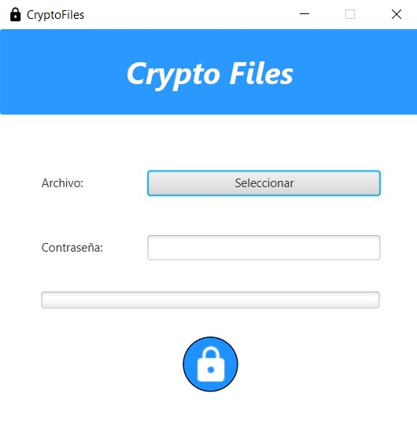
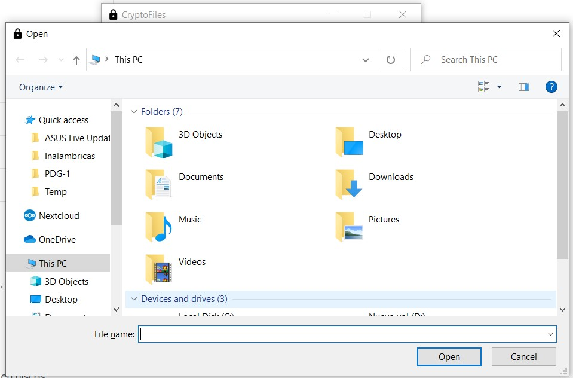
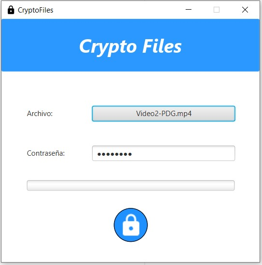
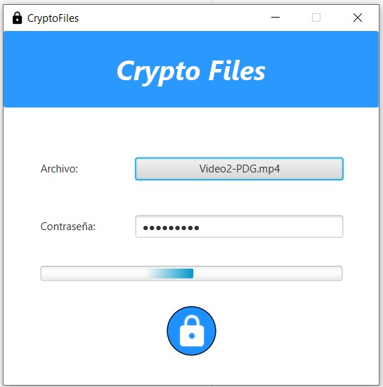
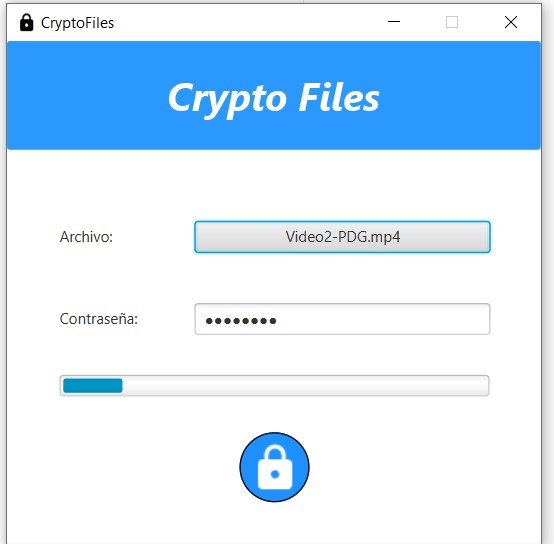
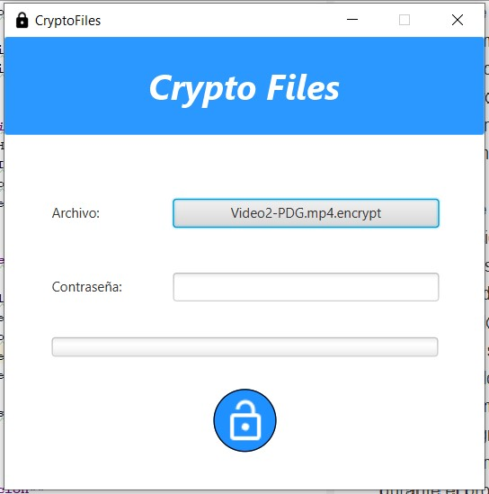
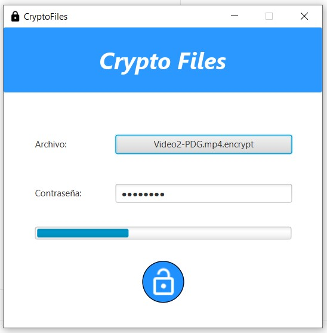
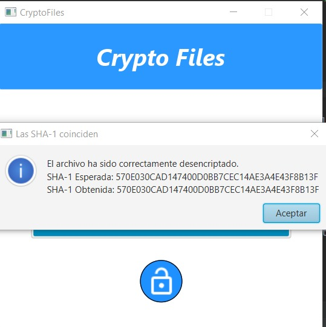

# CryptoFiles

 

La interfaz gráfica del proyecto se realizó usando JavaFX, de tal manera que a través de un FileChooser se pudiera seleccionar un archivo,
y mediante un campo de texto, ingresar un passphrase, que mediante el algoritmo [PBKDF2](https://github.com/CarlosEduardoL/CryptoFiles/blob/bae10121ed6a372abdc957f9f713f8a7566f10aa/src/main/kotlin/util/CryptoUtils.kt#L29), la convierte en una llave para el algoritmo AES.
El programa permite dos modos: Encripción y desencripción.

## Encripción
- Toma el archivo y se calcula su [SHA1](src/main/kotlin/util/Utils.kt) correspondiente.
- Convierte el archivo en un Fileinputstream
- Se crea un outputstream con un archivo que será el destino del cifrado con extensión .encrypt.
- Se almacena en este archivo la SHA1 del archivo desencriptado.
- Usando un Cipheroutputstream se cifra el outputstream del archivo cifrado.
- Se pasa la información del Fileinputstream al Cipheroutputstream

## Desencripción
- Se lee la SHA1 almacenada en el archivo cifrado.
- Se pasa el Inputstream del archivo cifrado al método de desencripción.
- Se desencripta el archivo usando un Cipheroutputstream.
- Se calcula el [SHA1](src/main/kotlin/util/Utils.kt) del archivo desencriptado y se compara.

## Problemas encontrados

- No se calculaba el SHA1 de los archivos, solucionado con [esto](src/main/kotlin/util/Utils.kt)
- Debido a que se cargaba todo el archivo a memoria cuando se encriptaba,
   con archivos muy grandes el programa dejaba el computador inutilizable. por lo que el metodo de encripción ahora usa un stream.
- Debido a que se presentaba la misma situación en la desencripción, se optó por usar un stream.
- No habia feedback que reflejara que ya habian sido terminados los procesos. Lo solucionamos poniendo dialogos al final de cada proceso y también, pusimos una barra de progreso.
- Los botones no se bloqueaban durante el proceso de encripción o desencripción, así que la persona podía poner a encriptar o desencriptar varias veces el mismo archivo. Los solucionamos bloqueando los botones durante los procesos. 
- Solo podemos cifrar archivos cifrados con nuestro programa, estos tienen una extensión especial (.encrypt), dado esto y para simplificar la interfaz dejamos un solo botón que cambia según si el archivo es .encrypt o no, y efectua el proceso de encriptar o desencriptar. 

## Ejemplo de uso

### _**Encripción**_
- Se selecciona el archivo a encriptar
 

- Se presiona el boton
 

- Se espera a que el programa calcule la SHA-1
 

- Se espera a que termine el proceso de encripción
 

- El programa da aviso de la correcta finalización
 

 
 

### _**Desencripción**_

- Se selecciona el archivo para desencriptar. Extensión .encrypt
 

- Se presiona el boton de desencripción
 

- Se espera al final del proceso de desencripción
 

- Se comprueban los SHA-1 calculados por el sistema
 

